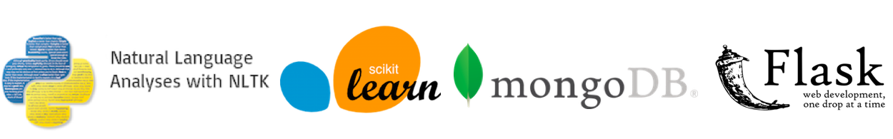

# WOTS
# Word On The Street NLP-Based Real Estate Recommender
WOTS is an NLP-based real-estate recommender to help home buyers to find their dream home in Seattle and for real estate agents to offer more relatable listings for their clients.

## Why WOTS?
The Seattle housing market continues to grow and real estate companies strive to use data to create more effective listings. Home buyers continued to seek a more advanced method for finding their dream home, beyond basic information such as square footage, number of bedrooms, etc. The WOTS recommender compares listings utilizing the rich text contained in their  descriptions and recommends homes of a smiliar style based upon the buyer's interest. In addition, WOTS compares neighborhoods based on your potential neighbors' reviews and recommends homes of similar style in alternative neighborhoods with a similar vibe.

